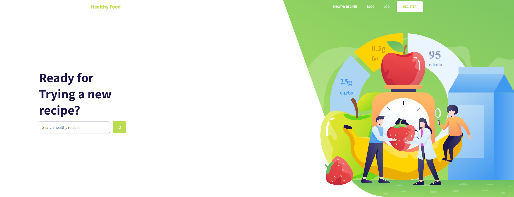

<h1 align="center">
    
</h1>

## 💻 Sobre o projeto

 🍳 Healthy Food - Foi um teste do processo seletivo do grupo GCB para a vaga de Desenvolverdor Front-End Jr 

O objetivo deste desafio era para fazer as seguintes configurações:
- Desenvolver o site que está em anexo utilizando toda a estrutura do React, o site tem que ser 100% responsivo, iremos avaliar bem a responsividade.
- Criar a tela de cadastro baseada na tela inicial, o cadastro precisa receber os dados:
  - Nome
  - Data de nascimento
  -  CPF
  - CEP
  - Utilizar a API dos correios para preencher os demais campos que compõe o endereço.
  - Validação dos campos
  - Armazenar os dados do formulário no local storage e Cookies.

## 🎨 Layout

### Web

  

### Mobile

  

## 🛠 Tecnologias
As seguintes ferramentas foram usadas na construção do projeto:

- [x] React.js
- [x] Yup
- [x] PropTypes
- [x] React_Router_Dom_V6
- [x] useContext
- [x] Styled_components
- [x] React-icons
- [x] React-scroll
- [x] Aos

## 📝 Licença

Este projeto esta sobe a licença MIT.

Feito com ❤️ por Weslei França 👋🏽 [Entre em contato!](https://www.linkedin.com/in/wesleifranca/)
